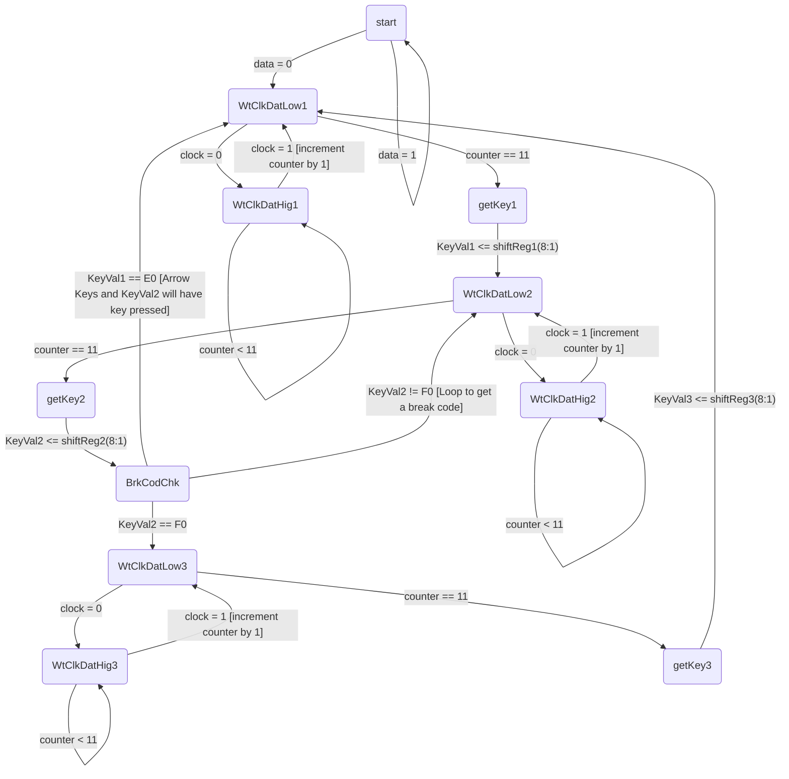

# ECE241 Project PS2 Input
Investigation into PS/2 inputs
## Overview
- PS/2 keyboard inputs run through a serial port where data is transferred as a bitstream through a data line and facilitated by a clock line.
- Each key has an assigned make and may have a break code which indicates when a key is pressed (and held) and when a key is released. Some keys have unique behaviour but I will not speak much about those keys as they are not commonly used. You can find all the make / break codes below.
For additional information on the exact topics discussed below, visit [PS/2 Controller](https://www.eecg.utoronto.ca/~jayar/ece241_08F/AudioVideoCores/ps2/ps2.html).
## Bitstream
The bitstream sends packets of information which can be uniquely identified by the controller / interface. There is 1 start bit, 8 data bits, 1 parity bit and 1 stop bit which adds to 11 bit packets.
- A start bit is always a low and because the data line is held high when idle, this indicates the start of the bitstream. 
- Next are the 8 data bits which can be the make/break code or part of it (as some make/break codes consist of more than 1 byte/8 bits). 
- Next is the parity bit (odd parity) which represents the number of 1s in the data bits and the parity bit itself must be an odd number. This parity bit provides some error protection if your system requires it. 
- Finally, we have the stop bit which is always high and indicates the end of the bitstream so the controller / interface can verify the length of the bitstream.
Below is an image of the bitstream
[]
For additional information, visit [Computer Engineering PS/2 Mouse/Keyboard Protocol](http://www-ug.eecg.utoronto.ca/desl/nios_devices_SoC/ARM/datasheets/PS2%20Protocol.htm).
## Make and Break Codes
Each key is assigned a make code which can consist of one or more bytes of data. For many keys, it's a single byte but for some keys, there is an extension byte (E0) which is added to some keys. For example, the 'Home' key is E06C because on the numpad, the '7' key is 6C and the num lock key would typically switch the '7' key to be the 'Home' key. The same thing occurs for the arrow keys.
Break codes are also unique, often consisting of the break byte (F0) and the associated make code following. For keys with extension bytes, the extension byte falls before the break byte. While some keys do not have a break code such as the 'Pause/Break' key.
The PS/2 Keyboard chip does not store any states such as shift, caps lock or num lock, such states must be handled by the controller / interface. Due to the simplify of my project, I will not implement and therefore document implementing this feature, but this behaviour can be utilized to create customized keyboard layouts and functions.
Below are a list of compiled lists containing make / break codes
- [Ben Eater Google Doc Scan Codes](https://docs.google.com/document/u/0/d/1w--ouGvSSf93tFltmBcSRGMN8Rte7ayalQZRDPG0ezk/mobilebasic) - Has a more complete set of scan codes
- [Altium Website Scan Codes](https://techdocs.altium.com/display/FPGA/PS2+Keyboard+Scan+Codes) - Site takes quite some time to load

Below is an image which provides more of a visual display of the make codes
[]
## Implementations
There are various ways to create a controller which can interface with the keyboard. After research, I've found solutions using finite state machines (FSMs) and using negative edge clocks from the keyboard itself. I did reference my experience in the [[README]], but I found using the negative edge clocks more intuitive and easier to debug (I spent over 6 hours trying to get the FSM to work but without success while the negative edge clock took me less then 2 hours to get working).
### Finite State Machine Solution
This solution is based on [LBE books PS2 Keyboard Interface Video](https://www.youtube.com/watch?v=EtJBqvk1ZZw) which is built in VHDL.
Using a FSM, we can create loops to take in the data from the bitstream, and load them into output registers once one byte packet has been fully received. This can be repeated for a second time. Next we can have a check for break codes and extension bytes, which determine where to place the next byte of data. For any break code (which will be found in the second output register), we will place the next byte of data into the third register, indicating we have released that key. In the case of a single byte make code, we check if the first output register is an extension key, if so, we place the next byte of data into the first register (using the respective), if not, we continue to place the next byte of data into the second register (using the respective loop). This ensures that the first output register will hold the potential extension byte, the second output register will hold the main key code byte or the break byte and the third output register will hold the main key code byte (if the second register is holding the break byte).
#### State Diagram

#### Notes
As mentioned above, I was not able to get this solution to work. This solution also only works if at most one key is being pressed at any given time. For example, if a non-extension byte is placed into the first register, and a key with an extension byte is pressed, the second output register will switch between the extension byte and the main key code byte until a break byte is produced, reseting the loop.
### Negative Edge Clock
This solution is based on [Indian Institute of Technology Kanpur PS2 Keyboard PDF](https://students.iitk.ac.in/eclub/assets/tutorials/keyboard.pdf), my implementation is slightly different, shifting the counter so it can be used to index the data into the correct register position. Additional information on a similar implementation can be found in [Ben Eater's Youtube Video](https://www.youtube.com/watch?v=7aXbh9VUB3U).
The idea is as follows, whenever the PS/2 clock has a negative edge, we can check if the data pin goes low. When this happens, we know it is the start of the bitstream. We can use an internal counter which can keep track of the number of negative edges that have passed to placed the data in the correct location. When reaching the parity bit, you may decide to use it, but just like the Indian Institute of Technology's PDF, I have chosen to ignore the parity bit as this is a low importance program. On my program, I've chosen on the stop bit, to move all the data into a output at the same time so other modules that may need the PS/2 input can easily detect a change (which will reflect an entire key, not just the bitstream incoming).
Just like Ben Eater's Video, I've linked additional outputs to act as a history of the previous data bytes to make detect of extension bytes and break codes easy.
