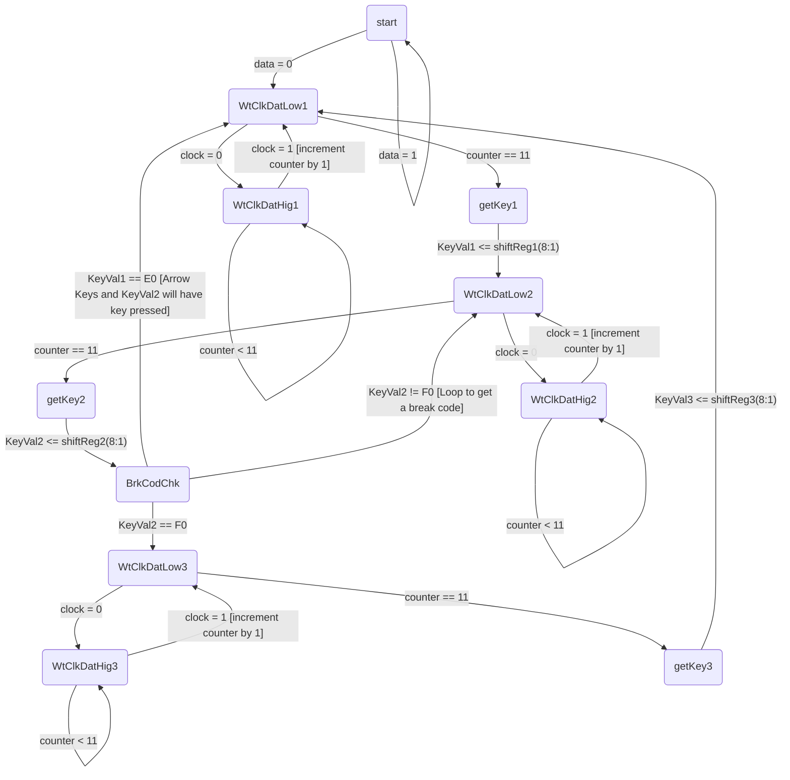

# ECE241 Project PS2 Input
Investigation into PS/2 inputs
## Make and Break Codes
[]
Above is the make codes for all the keys on the keyboard.

[]
All make and break codes can be found on [altium site](https://techdocs.altium.com/display/FPGA/PS2+Keyboard+Scan+Codes)
## State Diagram

