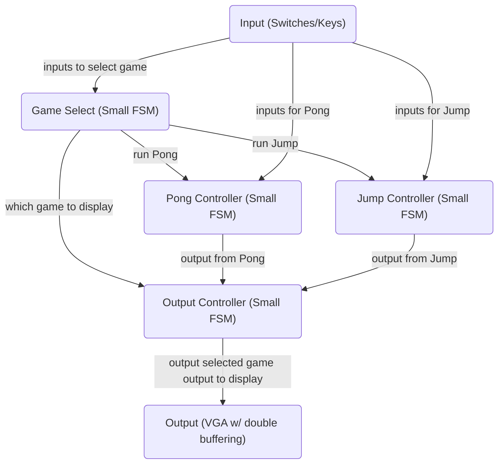

# ECE241 Project Proposal
*Note: Due to lack of contribution by my lab partner, __REDACTED__ I am writing this project proposal as an individual. I have spoken with a TA in my section and there should have been some conversation with the head TA about my situation but as of writing, I have not received any response. As a result, I have also sent a message to all the instructors and TAs listed on Piazza as a private message to try to have this situation resolved. I will be available all of reading week and will be working on my project so if there is additional information needed from me, please let me know so we can find a solution.*
## Team Members
Alwyn T, UTORID: __REDACTED__, student number: __REDACTED__
*Only one member is listed, please refer to the note above*
## Components
1. Small FSM; less than 10 states (0.25 points)
2. Switches and keys (0.25 points)
3. VGA display, Moving images with double buffering (0.5 points)
Total point count is 1 point
## Project Description
Using the components listed above, I hope to create a small collection of interactive games with animations similar to a retro console. The goal is to use the switches and keys as a basic input method in any of menu pages to select a game and within each game; The small FSM will be used to select the desired game and adjust any attributes the game may have; Additional FSMs will be found within the games; The VGA display will be used to create an output for the users to be able to see and react to.
### Games
1. Pong: Classic Pong game, bouncing a ball back and forth between two paddles
2. Jump: Similar to the mobile game Doodle Jump where platforms appear and the goal is to move left and right to jump as high as possible.
**High-Level Block Diagram**

## Milestones
Nov 6th - Nov 12th
Build initial version of all modules, Inputs, Game Select FSM, Game Controllers, Output Controller and Output itself. The goal is to have them all created individually so I can test their individual inputs and outputs and verify they work independently.
Nov 13th - Nov 19th (Lab 7 ‐ Memory and VGA)
Attempt integration with small sections starting from the game select, to the pong controller and connecting all the inputs into the correct locations. The goal is to have all controllers connects where there maybe some bugs, but if used correctly, the input to output results will be what I desire. Because debugging may take a long time, I will begin debugging large bugs.
Nov 20th - Nov 26th
Debug all bugs that may still exist in the system, because this process began the week before, there should only be small bugs left. Finally, I can add polish to the games, it be specific to the graphics to make the final product presentable.
Nov 27th - Dec 3rd
If there is still time, I may spend time polishing but likely I will not and this week will be for the demo week.
**Division of tasks**
Because I am working alone on this project, I will be working on all parts. I will follow the milestones quite closely to ensure I am able to create a cohesive project as I don't have a partner.
