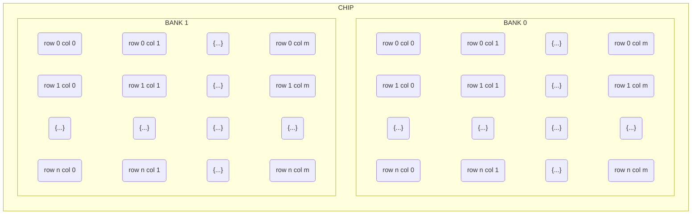

# ECE241 Project SDRAM
To achieve memory storage and be able to create video buffers, SDRAM can be used.
## Warning
It took me over a week to get a working implementation of a SDRAM controller as the FPGA board does not have much documentation on the SDRAM interface. This is complicated with various bridges and IP interfaces which do not work with each other or have flaws making them not applicable. As such, I recommend anyone trying to implement a SDRAM controller to research how the SDRAM works on your FPGA board (which may take awhile if there is limited documentation), only then should you research different implementations or should you attempt building your own controller. It is important to understand that there are many ways to implement the SDRAM interface which may be specific to your FPGA board. Additionally, during my research, I mostly found resources for the HPS (hard processor) which was out of my scope for this project which made it difficult to find the information I needed. Finally, I recommend paying close attention to timing, within the specifications on SDRAM chip data sheets, there are ns and us timings for various signals; ensure that your FPGA board is able to and is producing such timings as without, there likely will be no output. For some timings, data sheets may refer to the 'standard speed bins', this refers to the standard which the SDRAM is based on; For example, the 'JEDEC STANDARD DDR3 SDRAM. JESD79-3C' is the standard for the ISSI IS43/46TR16256A DDR3 chip on the DE1-SoC board.
## Overview
* Using row, col and bank addresses, a virtual pointer can be placed at a memory address so actions can be made.
* Using bidirectional pins, a host (the FPGA chip) can send or receive data based on the given commands sent on other associated address and enable pins.
* SDRAM requires refreshing of its data, therefore it can not take commands at all times and due to the addressing, it may take a few clock cycles to retrieve desired data.
* Some SDRAM chips allow for burst data transfers which can prove useful for large data transfers but may not always be available for all SDRAM chips.
## Memory Addressing
Within each ram module, there are often smaller memory chips which are linked to create larger memory chips and increase transfer rate. Within each chip, there are banks, of which each has `n` rows * `m` columns bytes. This allows for multiple banks to be accessed at the same time increasing the bandwidth of the memory.

Additional information can be found on [Depletion Mode: Understanding DDR Memory Mapping](https://depletionmode.com/ram-mapping.html). Note, the website talks about DDR, the same principle are applicable to SDRAM; the main difference is that DDR runs at equivalently double the speed as it is able to read/write on the rising and falling edge of the clock. More on the differences can be found on [GeeksForGeeks: Difference between DDR and SDRAM](https://www.geeksforgeeks.org/difference-between-ddr-and-sdram/).
## Unique Pin Behaviour
Each SDRAM has their own specifications so it is recommended that you refer to the data sheet for your respective SDRAM chip and FPGA board. Please read the note at the bottom of this section for an example.
Part of the SDRAM interface specifications, there are bidirectional pins for data transfer. The purpose to reduce the number of pins required for a SDRAM chip and because most systems only read or write at any given time, the compromise is to use the same pins for reading the data output and for write the data input. This means there needs to be special attention placed to the timings to avoid data being lost during transfers. As such, it is recommended to either use or build a custom controller to handle the logic for reading and writing to ensure no read or write commands and the data is sent when the SDRAM is completing a task.

For example, on the DE1-SoC board, the SDRAM is ISSI IS42S16320D-7TL-TR and the data sheet can be found on [Mouser: ISSI IS42S16320D-7TL-TR data sheet](https://www.mouser.ca/datasheet/2/198/42-45R-S_86400D-16320D-32160D-258456.pdf). But due to the architecture of the board, there are a unique set of pins for interfacing with the SDRAM from the FPGA chip. In this case, the pins includes DRAM_DQ\[15:0], DRAM_ADDR\[12:0], DRAM_BA\[1:0], DRAM_CLK, DRAM_CKE, DRAM_LDQM, DRAM_UDQM, DRAM_WE_N, DRAM_CAS_N, DRAM_RAS_N, DRAM_CS_N, found on the [Terasic: DE1-SoC User Manual](https://www.terasic.com.tw/cgi-bin/page/archive.pl?Language=English&No=836&PartNo=4). 
## Memory Refresh
Unlike store mediums like HDDs (hard drives) or SSDs (solid state drives), SDRAM is active memory rather than passive memory, which means it requires power to store data. In other words, the signal will degrade and so the FPGA chip is responsible for sending refresh commands to the SDRAM chip to ensure all memory is not lost. In some cases, the FPGA board will have additional circuitry which will handle the memory refresh cycles. Please refer to the SDRAM chip and FPGA board data sheet to know exactly. In the cases where there is no additional circuitry, the memory refresh cycles are often implemented into the SDRAM controller. If you need to implement the memory refresh cycles, please refer to the SDRAM chip data sheet for the required timings including the frequency of the refresh cycles and the duration of the refresh cycles.

For the DE1-SoC board, the SDRAM chip data sheet is [Mouser: ISSI IS42S16320D-7TL-TR data sheet](https://www.mouser.ca/datasheet/2/198/42-45R-S_86400D-16320D-32160D-258456.pdf).
## SDRAM Burst Data Transfer
As mentioned above, SDRAM is the precursor to DDR and has equivalent to half the data transfer time. Due to the limit transfer rate, some SDRAM chips have the capability to do burst data transfers. Bear in mind the burst data transfer is not available for all SDRAM chips, please refer to the SDRAM chip data sheet for the specifications. Burst data transfers works by prompting the SDRAM chip with the length of the burst data you wish to read or write. Data is then sent or received sequentially starting from the starting address. This allows large data transfers at the speed of the clock, removing the need to wait for a response before sending the next command.

Additional information can be found on [Stack Exchange: Burst-size of a SDRAM](https://electronics.stackexchange.com/questions/349834/what-does-burst-size-of-a-sdram-means) and [Wikipedia: Bursting Order](https://en.wikipedia.org/wiki/Synchronous_dynamic_random-access_memory#Burst_ordering).
## Implementations
### Platform Designer and Avalon® Memory-Mapped Bridges
Note: some old resources reference Qsys which is the original name of the Intel Platform Designer
Using the Platform Designer, you can create a system using the SDRAM Controller Core IP in conjunction with a PLL for the timing clock. The Avalon® Memory-Mapped Bridges can then be used to create the command and refresh controller that feeds directly into the SDRAM Controller from the system above. The SDRAM Controller Core details can be found on [Intel:  Embedded Peripherals IP User Guide](https://www.intel.com/content/www/us/en/docs/programmable/683130/21-4/sdram-controller-core.html) and the Avalon® Memory-Mapped Bridges can be found on [Intel: Avalon® Memory-Mapped Primary Templates](https://www.intel.com/content/www/us/en/support/programmable/support-resources/design-examples/horizontal/exm-avalon-memory-mapped-primary.html).
### Custom Controller
This requires a full understanding of the SDRAM specifications and therefore I recommend referring below to similar projects to learn more.
## Similar Projects
Below are similar projects which I utilized to learn the SDRAM specifications
* Alchitry Verilog Tutorial - an in depth tutorial on the verilog implementation of a SDRAM controller can be found on [Alchitry's website](https://alchitry.com/sdram-verilog). The author explains the various states of the controller but does not touch on the timing, therefore this resource provides a base understanding rather than a full implementation.
* Navraj Kambo's - A project for audio processing, encoding and decoding with the ability to save the results. This repository includes his own implementation of a SDRAM controller and linked is another repository specific to the SDRAM for the DE0 board. Respository can be found on [Github: DE1-SoC Verilog Audio HW FX](https://github.com/navrajkambo/De1-SoC-Verilog-Audio-HW-FX).
* Intel Simulating DDR3 - This video is about creating a simulation of a SoC HPS DDR3 Core. Although not a SDRAM chip, it may provide insight into simulating a design and how the SDRAM controller may interact as it is similar to a DDR3 chip. Video can be found on [Youtube: Simulation of SoC HPS DDR3 Core](https://www.youtube.com/watch?v=tFLaiqIdDlQ).
* SDRAM and FIFO on DE1-SoC - This video is about creating a SDRAM controller and FIFO (first in first out) module using the VHDL. Language used is not Verilog and therefore I only used this video for reference and understanding the logic for the SDRAM controller. Video can be found on [Youtube: Tutorial:Using SDRAM and asynchronous FIFO on DE1-SoC FPGA Board](https://www.youtube.com/watch?v=euw0ILLTEhM).
