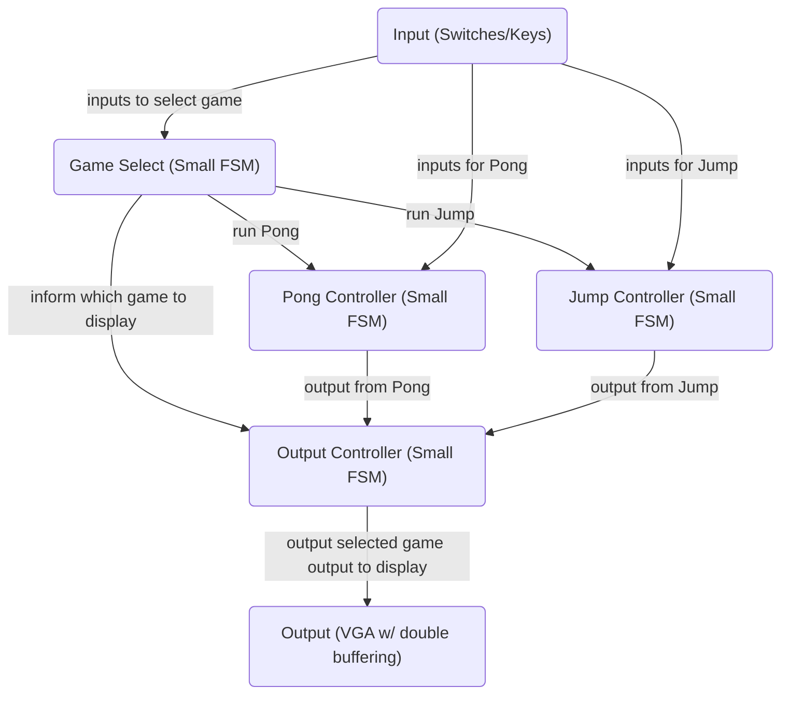
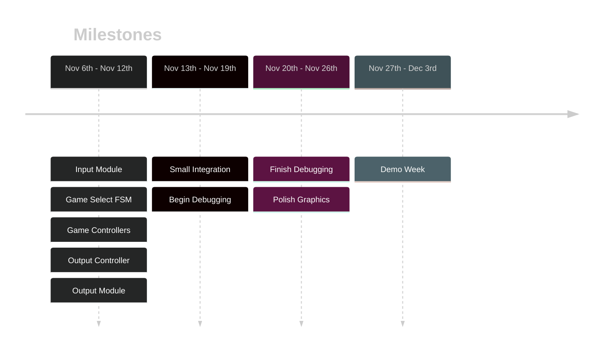

# ECE241 Project
Final Project for ECE241: Digital Systems
## Resources
Refer to [[ECE241 Project Resources]]
## Project Description
Refer to [[ECE241 Project Proposal]] for full description. 
#### Games
1. Pong
	- Classic Pong game, bouncing a ball back and forth between two paddles
2. Jump
	- Similar to the mobile game Doodle Jump where platforms appear and the goal is to move left and right to jump as high as possible.
### High-Level Block Diagram

## Project Extension
- 3D renderer
- PS/2 Keyboard inputs
- PS/2 Mouse inputs
- Memory Storage (calculator ALU)
### Project Timeline

## Documentation
### Nov 6th
Went into the drop-in lab from 8am - 12am with the goal to finish lab 7 and the PS/2 input.
Finished initial draft of lab 7 modules. I believe the tester for part 1 is bugged and therefore I was not able to fully submit part1.v. The automarker was expecting the output of the memory block one index ahead of the memory block requested by the user. I was able to finish part2.v during the lab session, the simulator and tester provided positive results but when uploading the bitstream, I had to rewrite a large section as there is no way to change register variable values under different clock edges. My solution is not quite what the lab document is asking for so I may send a message to the TAs about this issue. Nevertheless, I attempted to upload the new module and managed to do so successfully but the squares only showed up on the diagonals and there was a bug where a square drew all the way to the top of the screen instead of just the square. After going home, I realized the circuit had multiple independent if statements which may have caused overriding of values and so I created a fix. I plan to test the module tomorrow.
### Nov 7th
Went to the drop-in lab from 8am - 12am
- Fix from yesterday where I changed all the if statements to be if else statements seems to have fixed the issue where the pixel was drawn as a vertical strip. (I still believe it is because a false positive/negative can be put into the FPGA board and so it may have overwritten some values and caused it to run out of the 4x4 pixel loop)
- VGA module for lab 7 is complete, there are still cases where a 4x4 pixel will become a vertical line, but that only occurs when the pixel is drawn at the edge where there is no overflow protection
- PS/2 Keyboard module is nearly complete. I was able to get signals from the keyboard into the FPGA using the clock and data lines. I will have to do some debugging as the values are not expected, I checked the different FSM states and found even when a button was held down, it would oscillate from state 1 to state 2 or state 3 and give a different output after pressing the same key a few times. I plan to solve this issue tomorrow.