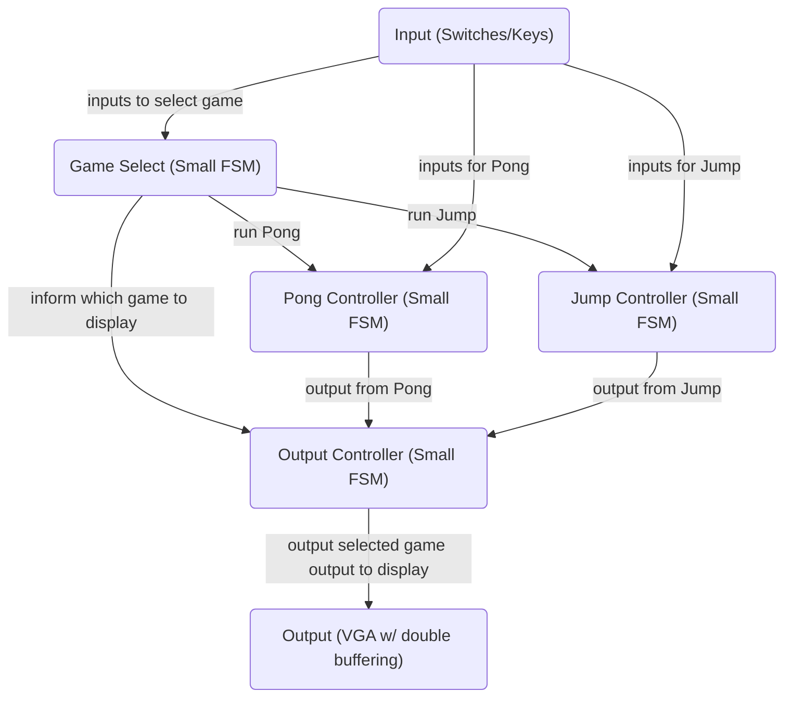
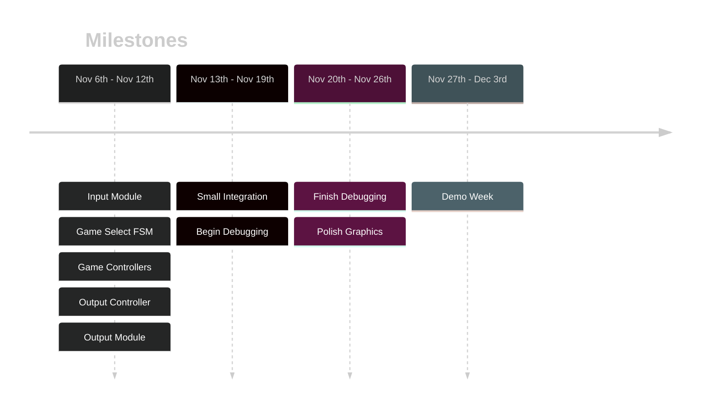

# ECE241 Project
Final Project for ECE241: Digital Systems
## Resources
Refer to [[ECE241 Project Resources]]
PS/2 Input - [[ECE241 Project PS2 Input]]
## Project Description
Refer to [[ECE241 Project Proposal]] for full description. 
#### Games
1. Pong
	- Classic Pong game, bouncing a ball back and forth between two paddles
2. Jump
	- Similar to the mobile game Doodle Jump where platforms appear and the goal is to move left and right to jump as high as possible.
### High-Level Block Diagram

## Project Extension
- 3D renderer
- PS/2 Keyboard inputs
- PS/2 Mouse inputs
- Memory Storage (calculator ALU)
### Project Timeline

## Documentation
### Nov 6th
Went into the drop-in lab from 8am - 12am with the goal to finish lab 7 and the PS/2 input.
Finished initial draft of lab 7 modules. I believe the tester for part 1 is bugged and therefore I was not able to fully submit part1.v. The automarker was expecting the output of the memory block one index ahead of the memory block requested by the user. I was able to finish part2.v during the lab session, the simulator and tester provided positive results but when uploading the bitstream, I had to rewrite a large section as there is no way to change register variable values under different clock edges. My solution is not quite what the lab document is asking for so I may send a message to the TAs about this issue. Nevertheless, I attempted to upload the new module and managed to do so successfully but the squares only showed up on the diagonals and there was a bug where a square drew all the way to the top of the screen instead of just the square. After going home, I realized the circuit had multiple independent if statements which may have caused overriding of values and so I created a fix. I plan to test the module tomorrow.
### Nov 7th
Went to the drop-in lab from 8am - 12am
- Fix from yesterday where I changed all the if statements to be if else statements seems to have fixed the issue where the pixel was drawn as a vertical strip. (I still believe it is because a false positive/negative can be put into the FPGA board and so it may have overwritten some values and caused it to run out of the 4x4 pixel loop)
- VGA module for lab 7 is complete, there are still cases where a 4x4 pixel will become a vertical line, but that only occurs when the pixel is drawn at the edge where there is no overflow protection
- PS/2 Keyboard module is nearly complete. I was able to get signals from the keyboard into the FPGA using the clock and data lines. I will have to do some debugging as the values are not expected, I checked the different FSM states and found even when a button was held down, it would oscillate from state 1 to state 2 or state 3 and give a different output after pressing the same key a few times. I plan to solve this issue tomorrow. Based on [LBE books PS2 Keyboard Interface Video](https://www.youtube.com/watch?v=EtJBqvk1ZZw).
### Nov 8th
Went to the drop-in lab from 8am to 2pm
- Edited the VGA module to not accept out of range values which fixes the overflow as the looping drawing function does not have the opportunity to loop out of range.
- Spent the first 4 hours trying to debug the keyboard inputs with no luck, the values seemed to be garbage values and nothing seemed to fix the issue even after testing through modelsim. The state machine seemed to give garbage values and go out of the loop causing the order of the data being read to be incorrect.
- Found a pdf talking about a different implementation which is more primitive but easier to debug. [Indian Institute of Technology Kanpur PS2 Keyboard PDF](https://students.iitk.ac.in/eclub/assets/tutorials/keyboard.pdf). For additional information, refer to [[ECE241 Project PS2 Input]].
### Nov 9th
Due to other commitments, I was not able to go to the drop-in lab
- Completed more documentation on the [[ECE241 Project PS2 Input]]. I may add more information in the future, but I believe it's a good baseline and may be useful for other people in the future to read through and learn quickly how the PS2 keyboard inputs work.
### Nov 10th
Went to the drop-in lab from 3pm to 6:30pm
- Implemented extension the PS2 input module by adding additional output registers to have a history of the keyboard inputs. I chose to have 3 output registers in total to be able to handle detecting the full break codes of the arrow keys.
- Additionally, I added the parity bit check. Using modulus 2, I can compare it to the parity bit exactly when it is sent, if it does match the parity, I raise a flag so the next cycle (during the stop bit), I will not save the value. The goal of this was to avoid having false inputs (which I noticed when pressing a certain order of keys). 
- I began another version of the VGA output (specifically the SVGA standard) to be able to produce higher quality output of 800 x 600 at 60hz. I plan to write up a full documentation on the process.
- Created a template for a shader module, which will take in basic 1 bit RGB values or 4 bit RGB values and return an adjusted 8 bit RGB values to create a more visually pleasing output.
- Created the pong game, currently runs on a 1hz clock for simplicity with many adjustable settings (speed of the ball, speed of the paddles, size of all objects). As of right now, the ball bounces off of all walls and the score of any player increases when hitting the paddle. I will change it when hitting the side walls, the ball is reset and the score is changed.
### Nov 11th
Due to other commitments, I was not able to go to the drop-in lab
### Nov 12th
Due to other commitments, I was not able to go to the drop-in lab
- Reviewed VGA controller and found that I forgot to wire the VGA_CLK, VGA_SYNC_N and VGA_BLANK_N. Because I was not able to go to the drop-in lab, I just compiled the new version and ensured there were no compilation errors so tomorrow I can quickly go to the lab and test the sof file.
### Nov 13th
Went to the drop-in lab from 11am to 1pm
- Shifted the output of the pong controller to a more significant bit which resulted in a visible result. The pong game is currently bugged with the ball not loading into the correct position and all objects not being able to be moved further than 160 pixels from the top, but I should be able to solve these issues in the coming days.
- I plan to continue investigating the VGA output as I don't believe the monitor centred the 800x600 frame, leaving pixels on the left and right not rendered. I may consider trying to get HD 1280x720 60Hz or HD 1920x1080 60Hz so I have a 16:9 screen ratio so the monitor may have a easier time to centre and align.
- This will likely be the last daily update as last week was my reading week and therefore I am starting classes again. Although I believe I have most of the ground work completed, I don't think the next parts will take much additional work to get working as it is simply now about finishing the final product.
### Nov 14th
Went to the drop-in lab from 3pm - 5pm
- Restructured code to have a 60Hz clock module, a pong game module (which handles all the logic and output) and a pong video module. This should make future additions such as the jump game easier to implement.
- I began work on a double buffer implementation, but due to the limitations of the DE1-SoC FPGA board, I am current unaware of any ram module which can store enough values except for manually instantiating registers.
- Continue to debug an issue with the PS/2 keyboard, where some seemingly random keys will trigger my custom key pressed flags even when they are not the same key.
- Additionally, began work on assets for the games to make the visual representation a bit more pleasant. 
### Nov 15th
Went to the drop-in lab from 11am - noon and 3pm - 5pm
- Added score display based on my hex_decoder, but modified to it can handle 2 digit decimal numbers. Moreover, I made it so the scores rest centred on the centre line and therefore the right score shifts to the right when turning for a single digit to double digits.
- Updated the order in which keys are read. For the past week, I have been trying to debug my keyboard input and was unsuccessful even though the bytes being picked up by the FPGA were accurate. I'm still not quite sure as to what caused the issue, but the fix was to load in the data into the shift registers when checking the parity data and then raising a newKey flag on the next cycle so other modules can do their key checks. Prior, I had some inconsistent behaviour, where some keys would be flagged as being pressed by other keys.