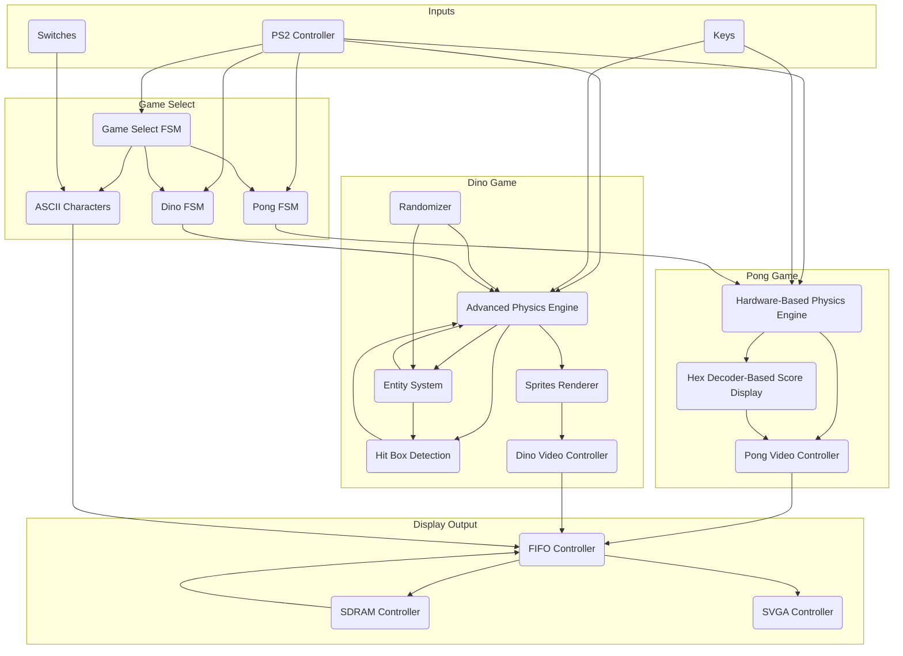
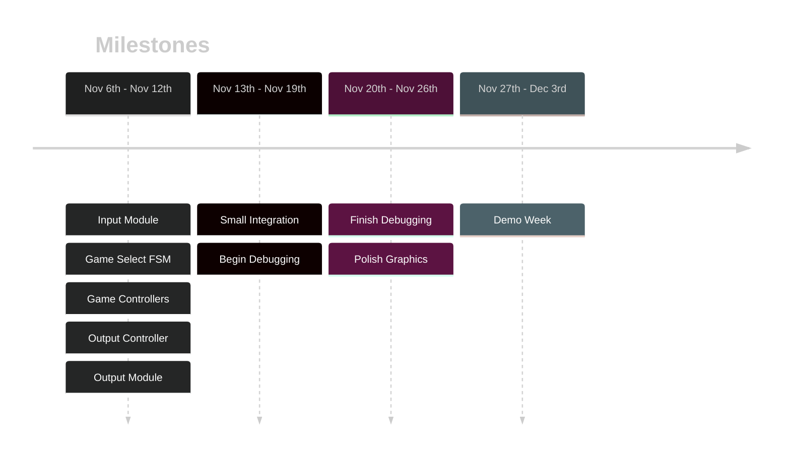

# Retro Graphics and Games on De1-SoC FPGA
Final project turned into a passion project focused on simulating retro style games using unique hardware architecture on the De1-SoC board.
Originally, this project was started as my final project for `ECE241: Digital Systems` course at UofT, but I saw an opportunity to push my knowledge and use my research skills to be able to develop this project further. The original project proposal can be found on the [ECE241 Project Proposal Page](ECE241%20Project%20Proposal.md).
## Resources
~~Below has some complex concepts, to read more please refer to below
Refer to [[ECE241 Project Resources]]
PS/2 Input - [[PS2 Input Protocol]]~~
## Project Components
This project has quite a few components that work either independently or dependently to create a coherent structured system. This version includes 2 games, pong and dino and a game selection screen, each with unique technology to support them. To see an overview, check out the [High Level Block Diagram](README.md#High-Level%20Block%20Diagram).
## Pong
The classic retro game, originally released by Atari, was the first game I recreated. I created a PS2 Keyboard controller to achieve simultaneous inputs, a hardware based physics engine and a hex decoder based score display.
### PS2 Controller
Used the negative edge of the PS2 clock line `PS2_CLK` to read `make` and `break` codes from the PS2 data line `PS2_DAT`, and toggle flags for specific keys. The toggle flags allowed for multiple key presses to be registered and held. Additional information can be found on the [PS2 Input Protocol Page](PS2%20Input%20Protocol.md).
### Hardware-Based Physics Engine
Registers were used to store current positions of all moving objects including the ball and the paddles. While wires were used to 'pre-calculate' next positions, so when the next frame is calculated, offscreen detection and collision detection is easily run and the appropriate interaction and next position is saved.
### Hex Decoder-Based Score Display
Utilized a previously created hex decoder as a basis to create a score display capable of showing 4 bit numbers in decimal format.
## Dino
Based on the `Dinosaur Game` by Google, was the second game I recreated. To give a more in depth gaming experience, I created more advance modules, including an advanced physics engine, a unique hit box detection, an entity system, a randomizer and a sprite renderer.
### Advanced Physics Engine
Based on the [Pong Physics Engine](README.md#Hardware-Based%20Physics%20Engine), with gravity acceleration and variable jump height based on how long the jump button is held. This process used slow falling, normal falling and stop velocities which are based on the true velocity and are held in wires. The true velocity is updated every frame dynamically, based on the jump duration, whether the jump button is held and whether the player is on the ground. All while the y position of the player is updated using the true velocity. Additionally, all velocities were offset between -128 to 127 to avoid error calculations.
### Hit Box Detection
Due to the cactus having various heights and being thin, and the bird being thin height wise, I used custom hit boxes to better represent the entities. The cactus hit boxes are based on their height and thinner than the width of their sprite and the bird hit boxes have a thinner height dimension.
### Entity System
Cycled between 4 birds and 4 cactus, all of which start offscreen on the right side. When the bird or cactus cooldown timer reaches 0, a bird or cactus respectively is dispatched and begins to travel across the screen.
### Randomizer
To allow the birds to fly at random heights, cactus to have random heights and for the cooldown timers to be randomized, I created a randomizer. I used 4 prime number counters (cycles from 0 -> prime number repeatedly) and combined the highest 2 bits of each counter to make a 1 byte output. Because this runs at 50MHz, and the game is started with user input, it seems randomized to humans.
### Sprites Renderer
Used block memory ROM to store a sprite map (additional tools I used to convert a css file to a mif file to come). Additionally, I was able to add an alpha bit, allowing for transparent pixels and therefore sprites to overlap without any issues.
## Game Select
The game selection screen served as a way to switch between each game and show additional information. To achieve the switching, I utilized multiple finite state machines. To show onscreen information, I implemented ASCII characters.
### Finite State Machines
One FSM is wrapped around each game and one additional FSM is used for the switching. For pong, the FSM has `start`, `game`, `pause` and `end`, while for dino, the FSM has a special `end_check` state which ensures that if you die while jumping, the game will wait for the space bar to be released before restarting. Game select is the overarching FSM which has `hover`, `load` and `ingame` for each game. When in `hover`, both games are disabled and the game select video controller is pushed through, while when `ingame`, the respective game video controller will be routed. Additionally, when going back to the game select screen, the game is paused and saved so when you re-enter, you don't lose progress.
### ASCII Characters
This is an extension of the [Dino Sprite Renderer](README.md#Sprites%20Renderer) but dedicated to a different format, I store 8x16 character sprites with 1 byte for each row as binary on/off. This binary format allows for easy recolouring using the switches to set the background or the text colour. `SW9` used to switch between background or text colour and `SW0` - `SW8` is used to set the RGB values.

## Display Output
To facilitate displaying the content from the video controllers, I implemented the SVGA standard and a video buffer (broken down into the SDRAM controller and FIFO controller) to ensure clean output.
### SVGA Controller
Rather than the typical VGA standard, I implemented 800 x 600 60Hz SVGA standard with a custom adapter. The main difference is it requires a 40MHz clock (achieved with a PLL) and unique timings. Additional information can be found on the [SVGA Protocol Page](SVGA%20Protocol.md).
### SDRAM Controller
This controller is responsible for read and writing to the SDRAM. I had lots of troubles but it ended up being the clock of the SDRAM needed to be shifted to ensure all data/signal lines were stable before the SDRAM reads them. My implementation runs the SDRAM chip at the max clock rate of 200MHz.
### FIFO Controller
The FIFO controller works in conjunction with the SDRAM controller and acts like a smaller buffer. Because the SDRAM takes a few cycles to read or write, I needed to pre-read data before it was needed by my display module. I ended up with a cool module which has two cursors, one is reading out of the FIFO buffer and one is writing into the buffer with data from the SDRAM. The cursor writing continuously tries to read from the SDRAM and writes in as long as the reading cursor is ahead. While the reading cursor takes from the buffer whenever the display module needs it. This ends up causing two different clocks to work on the same register memory space without conflict. Additionally, I modified the pong and dino video controllers to only send pixels that need to be updated. This requires storing the last position of the entities that are moving but ensures that whenever an entity moves, the new position can be drawn and the old position can be erased.

## High-Level Block Diagram

### Project Timeline

## Documentation
### Nov 6th
Went into the drop-in lab from 8am - 12am with the goal to finish lab 7 and the PS/2 input.
Finished initial draft of lab 7 modules. I believe the tester for part 1 is bugged and therefore I was not able to fully submit part1.v. The automarker was expecting the output of the memory block one index ahead of the memory block requested by the user. I was able to finish part2.v during the lab session, the simulator and tester provided positive results but when uploading the bitstream, I had to rewrite a large section as there is no way to change register variable values under different clock edges. My solution is not quite what the lab document is asking for so I may send a message to the TAs about this issue. Nevertheless, I attempted to upload the new module and managed to do so successfully but the squares only showed up on the diagonals and there was a bug where a square drew all the way to the top of the screen instead of just the square. After going home, I realized the circuit had multiple independent if statements which may have caused overriding of values and so I created a fix. I plan to test the module tomorrow.
### Nov 7th
Went to the drop-in lab from 8am - 12am
- Fix from yesterday where I changed all the if statements to be if else statements seems to have fixed the issue where the pixel was drawn as a vertical strip. (I still believe it is because a false positive/negative can be put into the FPGA board and so it may have overwritten some values and caused it to run out of the 4x4 pixel loop)
- VGA module for lab 7 is complete, there are still cases where a 4x4 pixel will become a vertical line, but that only occurs when the pixel is drawn at the edge where there is no overflow protection
- PS/2 Keyboard module is nearly complete. I was able to get signals from the keyboard into the FPGA using the clock and data lines. I will have to do some debugging as the values are not expected, I checked the different FSM states and found even when a button was held down, it would oscillate from state 1 to state 2 or state 3 and give a different output after pressing the same key a few times. I plan to solve this issue tomorrow. Based on [LBE books PS2 Keyboard Interface Video](https://www.youtube.com/watch?v=EtJBqvk1ZZw).
### Nov 8th
Went to the drop-in lab from 8am to 2pm
- Edited the VGA module to not accept out of range values which fixes the overflow as the looping drawing function does not have the opportunity to loop out of range.
- Spent the first 4 hours trying to debug the keyboard inputs with no luck, the values seemed to be garbage values and nothing seemed to fix the issue even after testing through modelsim. The state machine seemed to give garbage values and go out of the loop causing the order of the data being read to be incorrect.
- Found a pdf talking about a different implementation which is more primitive but easier to debug. [Indian Institute of Technology Kanpur PS2 Keyboard PDF](https://students.iitk.ac.in/eclub/assets/tutorials/keyboard.pdf). For additional information, refer to [[PS2 Input Protocol]].
### Nov 9th
Due to other commitments, I was not able to go to the drop-in lab
- Completed more documentation on the [[PS2 Input Protocol]]. I may add more information in the future, but I believe it's a good baseline and may be useful for other people in the future to read through and learn quickly how the PS2 keyboard inputs work.
### Nov 10th
Went to the drop-in lab from 3pm to 6:30pm
- Implemented extension the PS2 input module by adding additional output registers to have a history of the keyboard inputs. I chose to have 3 output registers in total to be able to handle detecting the full break codes of the arrow keys.
- Additionally, I added the parity bit check. Using modulus 2, I can compare it to the parity bit exactly when it is sent, if it does match the parity, I raise a flag so the next cycle (during the stop bit), I will not save the value. The goal of this was to avoid having false inputs (which I noticed when pressing a certain order of keys). 
- I began another version of the VGA output (specifically the SVGA standard) to be able to produce higher quality output of 800 x 600 at 60hz. I plan to write up a full documentation on the process.
- Created a template for a shader module, which will take in basic 1 bit RGB values or 4 bit RGB values and return an adjusted 8 bit RGB values to create a more visually pleasing output.
- Created the pong game, currently runs on a 1hz clock for simplicity with many adjustable settings (speed of the ball, speed of the paddles, size of all objects). As of right now, the ball bounces off of all walls and the score of any player increases when hitting the paddle. I will change it when hitting the side walls, the ball is reset and the score is changed.
### Nov 11th
Due to other commitments, I was not able to go to the drop-in lab
### Nov 12th
Due to other commitments, I was not able to go to the drop-in lab
- Reviewed VGA controller and found that I forgot to wire the VGA_CLK, VGA_SYNC_N and VGA_BLANK_N. Because I was not able to go to the drop-in lab, I just compiled the new version and ensured there were no compilation errors so tomorrow I can quickly go to the lab and test the sof file.
### Nov 13th
Went to the drop-in lab from 11am to 1pm
- Shifted the output of the pong controller to a more significant bit which resulted in a visible result. The pong game is currently bugged with the ball not loading into the correct position and all objects not being able to be moved further than 160 pixels from the top, but I should be able to solve these issues in the coming days.
- I plan to continue investigating the VGA output as I don't believe the monitor centred the 800x600 frame, leaving pixels on the left and right not rendered. I may consider trying to get HD 1280x720 60Hz or HD 1920x1080 60Hz so I have a 16:9 screen ratio so the monitor may have a easier time to centre and align.
- This will likely be the last daily update as last week was my reading week and therefore I am starting classes again. Although I believe I have most of the ground work completed, I don't think the next parts will take much additional work to get working as it is simply now about finishing the final product.
### Nov 14th
Went to the drop-in lab from 3pm - 5pm
- Restructured code to have a 60Hz clock module, a pong game module (which handles all the logic and output) and a pong video module. This should make future additions such as the jump game easier to implement.
- I began work on a double buffer implementation, but due to the limitations of the DE1-SoC FPGA board, I am current unaware of any ram module which can store enough values except for manually instantiating registers.
- Continue to debug an issue with the PS/2 keyboard, where some seemingly random keys will trigger my custom key pressed flags even when they are not the same key.
- Additionally, began work on assets for the games to make the visual representation a bit more pleasant. 
### Nov 15th
Went to the drop-in lab from 11am - noon and 3pm - 5pm
- Added score display based on my hex_decoder, but modified to it can handle 2 digit decimal numbers. Moreover, I made it so the scores rest centred on the centre line and therefore the right score shifts to the right when turning for a single digit to double digits.
- Updated the order in which keys are read. For the past week, I have been trying to debug my keyboard input and was unsuccessful even though the bytes being picked up by the FPGA were accurate. I'm still not quite sure as to what caused the issue, but the fix was to load in the data into the shift registers when checking the parity data and then raising a newKey flag on the next cycle so other modules can do their key checks. Prior, I had some inconsistent behaviour, where some keys would be flagged as being pressed by other keys.
### Nov 24th
Went to the drop-in lab from 3pm - 6:30pm
- After over a week of research, testing and debugging, I have finally created a proof build of a SDRAM controller. I learned that the memory IP that the labs suggested uses block memory which uses the transistors of the FPGA board itself to create memory cells. This solution does not provide sufficient space for a full video buffer and therefore I looked to other sources of storage. Eventually, I found SDRAM and DDR3 ram which took me down a long rabbit hole of trying to find the appropriate information to be able to build an appropriate controller. Due to the complexity and lack of feedback from the system, I had troubles figuring out a valid implementation. To learn more, please look at the [[SDRAM Protocol]] document.
- With the SDRAM controller, I am now able to work on the FIFO module and video buffer itself. I plan to work on this over the weekend so by Monday, I have move on to the other games I need to finish.